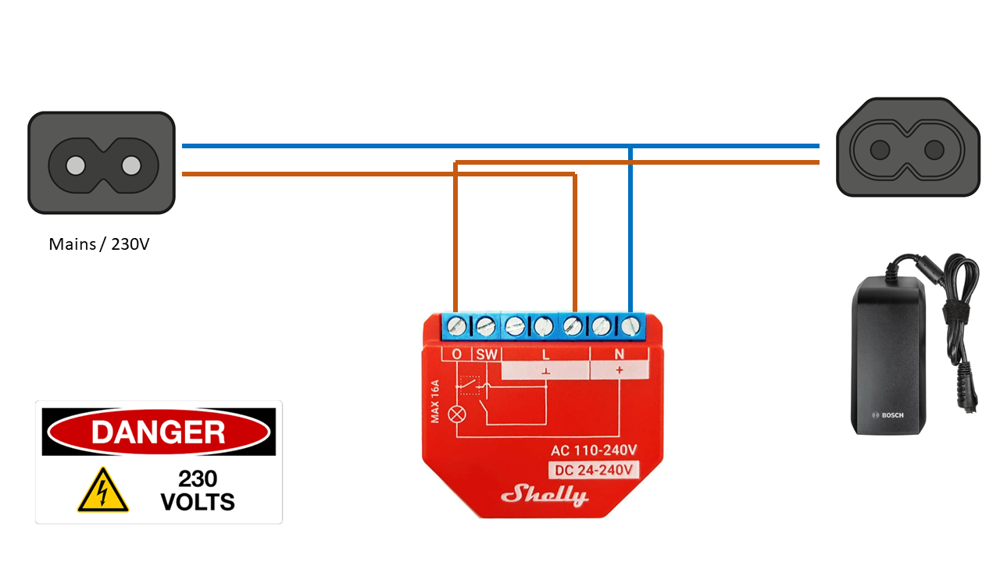
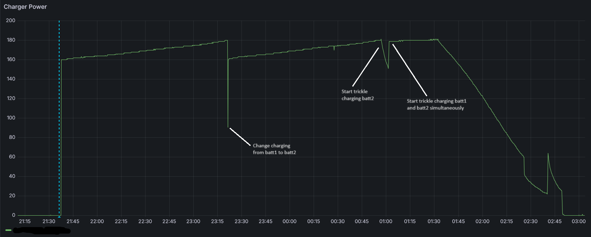
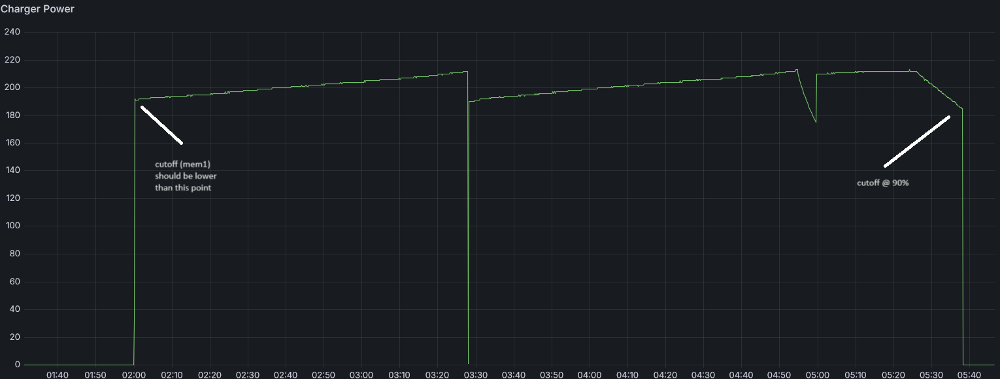
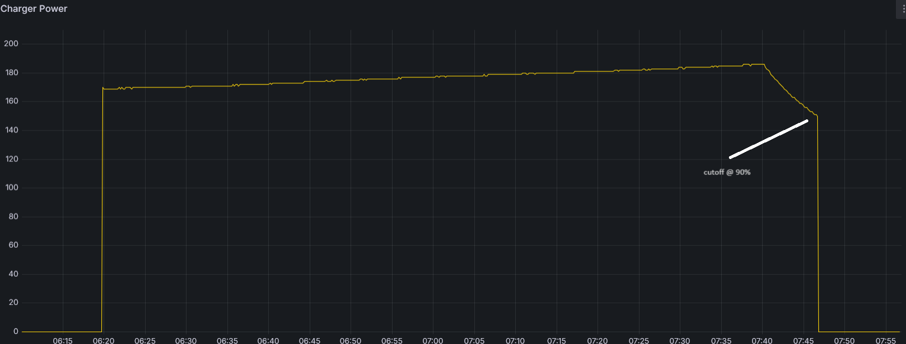

# Bosch ebike battery life extender
NOTE: this document uses 90% as indication of charge level. This is only a guestimate; charging will stop before Bosch system will stop charging. Whether this is 85%, 90% or 95% is not known. 
It can be guestimated from max range you get out of charged battery compared to a 100% charged battery, although that also has uncertainties.

Life of a Li-ion battery can be [prolonged](https://news.umich.edu/tips-for-extending-the-lifetime-of-lithium-ion-batteries/) among others by:
1. Limiting depth of discharge, limit number of cycles that you discharge battery to (almost) completely empty.
2. Limiting depth of charge, limit number of cycles that you charge battery above e.g. 80%-90%.
3. Minimize time spent at 0% charge (or near 0%), e.g. start charging asap to e.g. 30%-50%.
4. Minimize time spent at 100% charge (or near 100%).

Ad. 1:
* Select a battery with ample capacity for the distance you drive.
* Take into account that your battery range will decline over time.
* Battery management while you bike (lower support levels).

Ad. 2:
* Stop charging in time.

Ad. 3:
* Charge e.g. at office.

Ad 4:
* Start charging as late as possible, e.g. "Just in Time" before your next ride.

The "battery life extender" will implement #2 and #4:
* Start charging at a predefined time
* Stop charging when 90% capacity is reached. This is done by measuring the charging power. If charging power drops below a threshold, it will stop charging.

## Does it work (prolonging battery life)?
I am driving a R&M Supercharger 1, high speed pedelec (45km/h).
This is the non-smart system (older system) from Bosch.

### First set of batteries (dual 500Wh)
* I always kept these batteries fully charged;
* Connected to the Bosch charger whenever I got at home or at office
* ALso during weekends, breaks, vacations.
* After 45.000km, about 70% range left (compared to new set of batteries);

### Second set of batteries (dual 500Wh)
* At home: charge just in time (start 3AM in morning); stop at 90%.
* At office: start immediately charging, as I sometimes have to leave (unplanned) a bit earlier; stop at 90%.
* During weekends/vacations, store both batteries at 30-50%
* Immediately recharge till 30%-50% if battery is below 30% 
* Currently, after ca. 40.000km, >95% range left.

## Operating Principle
* Based on a Shelly Plus 1PM
* Shelly is reflashed with Tasmota firmware (as I have many more Tasmota based devices, I am familiar with these)
* Shelly device is programmed with Tasmota [RULES](https://tasmota.github.io/docs/Rules/)
* Note: you might be able to accomplish same with a Shelly out of the box; I am just not familiar with Shelly scripting capabilities.
### At Home
* Based on having a connection to WiFi @ Home
* Set time via NTP server
* Start charging at specified time (specified in mem4)
* Stop charging at 90%; cutoff specified in mem1
### At Office
* Based on not being connected to WiFi
* Set an artificial time - otherwise timers won't work
* Start immediately charging
* Stop charging at eg 90%

## Shelly
* [Shelly plus 1PM](https://www.shelly.com/en-nl/products/product-overview/shelly-plus-1-pm)
* Flash to [tasmota32solo1.bin](https://tasmota.github.io/docs/);
  * Method 1: [RS232 flash](https://tasmota.github.io/docs/Getting-Started/)
  * Method 2: [Over the Air flash](https://github.com/tasmota/mgos32-to-tasmota32)
    * Note1: You can connect via mobile phone or laptop to Shelly Access Point and browse to http://192.168.33.1; configure wifi, and look for new ip address at top of screen
    * Note2: If you cannot find Settings->Firmware; you likely have an older Shelly OS version; Update to latest Shelly, search for it in one of the menu's.
	* Note3: Download mgos32-to-tasmota32-Plus1PM.zip from [github](https://github.com/tasmota/mgos32-to-tasmota32/releases/download/v13.4.1/mgos32-to-tasmota32-Plus1PM.zip)
	* Follow instruction closely, otherwise you run risk of bricking the device. If you brick device, apply Method 1.

## Program Shelly
### Initial Configuration
* Browse to http://ip-of-my-shelly-device (ip was shown while flashing to Tasmota; check in DHCP leases page of your router)
* [Configuration](https://templates.blakadder.com/shelly_plus_1PM.html) - Auto-configuration:
  * Select Shelly Plus 1PM

### Console
* Browse to http://ip-of-my-shelly-device 
* In Tools - Console, copy following commands without comments;
* One line at a time;
* RULE x must be copied and pasted as a multiline block.
* [Console.txt without comments](file:console.txt)
```
; Set timezone
; See: https://tasmota.github.io/docs/Timezone-Table/
: Below is Europe/Amsterdam
Backlog0 Timezone 99; TimeStd 0,0,10,1,3,60; TimeDst 0,0,3,1,2,120;

; Default charging is ON after power up/reboot
PowerOnState 1

; var1: Internal variable: cutoff power; don't change
; var2: Current power consumption
; var3: "Timer Flag"; timer triggered; pending firing (1:timer triggered; 0:timer not active) 
; mem1: Cutoff power; parameter; change if you need different value
; mem2: Actual cutoff power when charging will stop; Read back for status/debug
; mem3: Timer delay (seconds); parameter; change if you need different delay
; mem4; Charging will start mem4 minutes after midnight. e.g. 360 = 6AM

; 170W is cut-off power
; 35sec delay; is enough to switch from batt1 to batt2 and recheck power consumption
; Disable and clear all rules
Backlog Rule0 0; Rule1 ''; Rule2 ''; Rule3 ''; TELEPERIOD 10; mem1 160; mem2 0; mem3 35; mem4 360; PowerOnState 1

; Set variable state after reboot (default is charging)
; Set time, otherwise timers don't work
; If connected to WIFI, stop charging (set delayed timer for this); trigger ntp query
; If actual power < threshold then trigger delay/timer (and check after delay if power is still below threshold)
; After boot, wifi, do not start charging (with delay via )

; System#Boot trigger runs ONLY after tasmota has successfully connected to the MQTT broker as a client
; Do not use tabs in idents

RULE1	
 ; Manual set time to 1-1-2024 12:00:00 CET; in case there is no WIFI; required for timers to function
 ; https://www.epochconverter.com/
 ; set cutoff power
 ;
 ; NOTE: select the right time (epoch) in relation with time in last trigger of rule1
 ; If WiFi is not detected, charging will start immediately....and stop when reached 90%....but
 ; last trigger of rule1 can start charging again....ensure enough time (eg 12 hours) between 
 ; manual set time and time trigger, such that it will not trigger when you charge when @ office
 ; Current default setting 12:00:00 localtime should be fine. Adapt epoch for your timezone
 ON Power1#boot DO backlog time 1704106800; var1 %mem1% ENDON
 
 ; If connected to WIFI network, start timer2 with 3sec delay  
 ON Wifi#Connected DO ruletimer2 3 ENDON  
 
 ; If charge power is below cutoff power and timer1 is not pending, start timer1 
 ; to allow eg changing from batt1 to batt2 - which will cause a temporarily power dip.
 ON Energy#Power<%var1% DO IF (var3==0) backlog var3 1; ruletimer1 %mem3%; ENDIF ENDON
 
 ; WIFI is connected; 3sec delay passed; We are @ HOME; Stop charging; Charging will be triggered by last 
 ; trigger in Rule1 
 ON rules#timer=2 DO backlog var1 -1; power 0; time 0 ENDON
 
 ; start charging at specified time
 ; mem4 minutes after midnight
 ON Time#Minute=%mem4% DO power 1 ENDON
;; END RULE1
	
; Check after delay, if power is still below cutoff
; If true, stop charging and store actual power in mem2
; Always clear timer flag
RULE2
 ON rules#timer=1 DO IF (var2<%var1%) backlog var1 -1; power 0 ;var3 0; mem2 %var2% ELSE var3 0 ENDIF ENDON
;; END RULE2  
  
; Store actual power consumption in var2 - used in other rules  
RULE3
 ON Energy#Power DO var2 %value% ENDON
;; END RULE3   
   
; Enable all rules   
Backlog Rule1 1; Rule2 1; Rule3 1
```
### Parameters
In console, you can change a few parameters (after you have programmed the rules from previous section)
* ```mem1 120```   ; set cutoff power to 120W
* ```mem4 600```  ; set time to start charging at 600min after midnight (e.g. 10am)
* This device is tested with Bosch power-tubes of 500Wh; Single and dual configuration. It should also work with 300/400/625Wh batteries. However, these might need a different cutoff power (mem1).
* Cutoff power should be smaller than the charging power when battery is empty (charging power is lowest for empty batteries - see graph below)

## Electrical Schematic


## Warning
This device requires working with hazardous voltage (110V/230V). Only qualified persons should work on this device.
Risk of deadly electrical shock.

## FAQ
* How are graphs below created?
  * MQTT + InfluxDB + Grafana (complex)
  * You can get similar graphs with Home Assistant and Tasmota plugin enabled (easier)
* Can the extender be used with the newer Bosch smart system?
  * I would expect so, but see below:
  * Measure the charge curves with e.g. Home Assistant
* Can the extender be used with non-Bosch systems?
  * Maybe, as long as the charger will decrease charge power when battery gets above 90% charge.
  * Measure the charge curves with e.g. Home Assistant

## graphs
### Dual 500Wh full charge


### Dual 500Wh 90% charge


### Single 500Wh 90% charge
